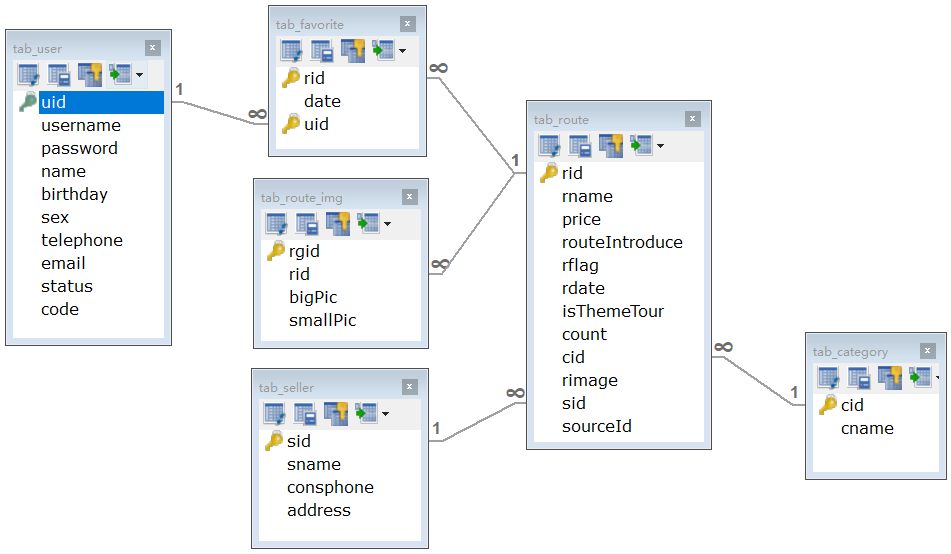

# ItCast-HeiMa-Travel
Java Web 实践项目：黑马旅游网
项目课程链接：https://www.bilibili.com/video/BV1CE411E7h4
完整课程连接：https://www.bilibili.com/video/BV1uJ411k7wy

## 技术选型

经典三层架构：**web层 - service层 - dao层** 

### 1. web层

- Servlet：前端控制程序
- HTML：前端页面（前后端分离架构，不适用JSP）
- Filter：过滤器
- BeanUtils：数据封装
- Jackson：json 序列化工具，前后端数据通用传输格式

### 2. service层

- JavaMail：Java 邮件工具
- Redis：nosql 内存数据库
- Jedis：Java 的 Jedis 客户端

### 3. dao层

- mysql：关系数据库
- druid：数据库连接池
- Spring Jdbc Template：数据库连接工具

## 数据库设计

```mysql
-- 船建数据库
CREATE DATABASE travel;
-- 使用数据库
USE travel;
```
其它建表 sql 语句详见：*连接待上传GitHub后指定*




## 功能实现

### 注册

注册表单如下，前台填充信息并点击`注册`按钮后实现账户注册。


1. 表单校验：前端接收外部输入，在浏览器端利用正则表达式实现校验并以CSS样式提示用户输入是否符合相关字段的条件。
2. 异步（AJAX）提交表单：在此使用异步提交表单是为了获取服务器响应的数据。因为我们前台使用html作为视图层，不能够直接从servlet相关的域对象获取值，只能通过 AJAX 获取响应数据。

### 激活

为什么要进行邮件激活？为了保证用户填写的邮箱是正确的。将来可以推广一些宣传信息，到用户邮箱中。


1. 发送邮件：在service层完成用户注册后，后端向用户提交的邮箱中发送激活邮件。
2. 用户点击邮件激活：构造 User Bean 对象时会同时设置`激活码`和`激活状态`属性，向用户发送的激活邮件中会带有激活码和激活连接。用户操作后，根据提交的激活码判断用户是否合法，合法则跳转至新的页面提示激活成功

### 登陆


#### index页面中用户名的提示


在 LoginServlet 中，在登陆成功的情况下将 loginUser 对象加入到 Session 对象中，index.html 页面会向后台会再次请求登陆用户信息，此时在 FindUserServlet 中从 Session 中获取 loginUser 对象并回写给 index.html 页面实现用户名提示。

### 退出

什么是退出？将用户信息从session中删除。

前端index.html中点击`退出`时，转向后端 exitServlet，在 exitServlet 中销毁session，同时跳转至 login.html 完成退出流程。

### Servlet优化

减少Servlet的数量，现在是一个功能一个Servlet，将其优化为一个模块一个Servlet，相当于在数据库中一张表对应一个Servlet，在Servlet中提供不同的方法，完成用户的请求。

 

### 分类数据展示

#### 展示效果


#### 功能分析


#### 代码实现

##### 后台代码

三层架构：CategoryServlet - CategoryService - CategoryDao

功能抽取：在BaseServlet中封装了序列化json的方法

##### 前台代码

hader.html加载后，发送ajax请求，请求category/findAll

#### 缓存优化

分析发现，分类的数据在每一次页面加载后都会重新请求数据库来加载，对数据库的压力比较大，而且分类的数据不会经常产生变化，所有可以使用redis来缓存这个数据。


##### 优化代码实现

期望数据中存储的顺序就是将来展示的顺序，使用redis的sortedset

### 旅游线路分页展示

点击了不同的分类后，将来看到的旅游线路不一样的。通过分析数据库表结构，发现，旅游线路表和分类表时一个多对一的关系


查询不同分类的旅游线路sql：Select * from tab_route where cid = ?;

#### 类别id的传递

Redis中查询score（cid）

页面传递cid

header.html传递cid

获取cid

#### 根据id查询不同类别的旅游线路数据


